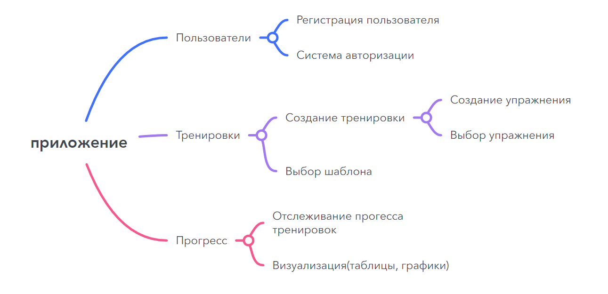

# Фитнес приложение

## Концептуальная модель

Фитнес приложение для спорта в котором пользователи смогут 
подбирать себе тренировки на базе существующих программ 
или составлять собственные. Иметь доступ к базе упржнений содежращие 
описание и демонстрацию техники.
 

Функциона на расширение. 

- Расчет шаблонов тренеровок с учетом параметров пользователя, его 
ограничениями и пожеланиями
- Группировка пользователей по системе тренер -> ученик для отслеживания прогресса,
удобства написания тренеровок.

## Функциональная карта

## Программный интерфейс 

### Beckend -> REST API (ASP.net core) 

Структура проекта:  

- DALL - проект работы с базой данных, подключение, контроль работы 
и основные интерфейсы взаимодействия
	- база данных: postgres
	- запросы: вручную(без фрейворков)
- Domain (ещё не знаю, впихать в бд DALL или вынести в отдельный проект 
для удобного тестирования и маштабирования) - уровень представления моделей
- Service - проект соединения базы данных и API. Реализует запросы к бд.
- API server - реализация маршрутизации 

Сущности:

расписать все сущности  

### frontend:  

